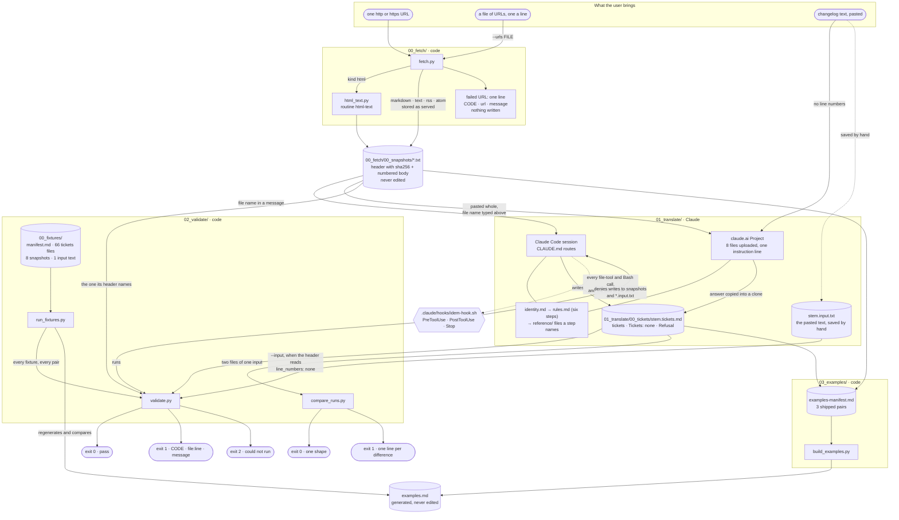
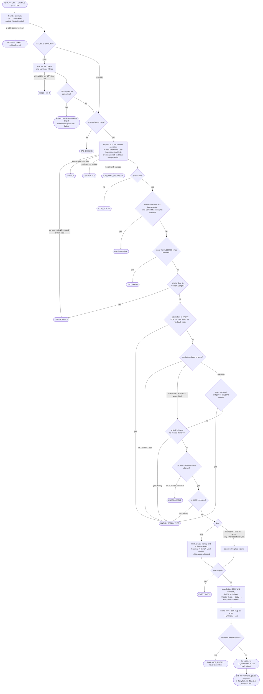
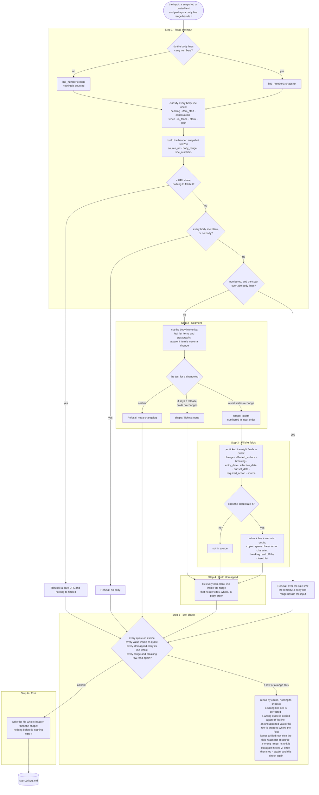
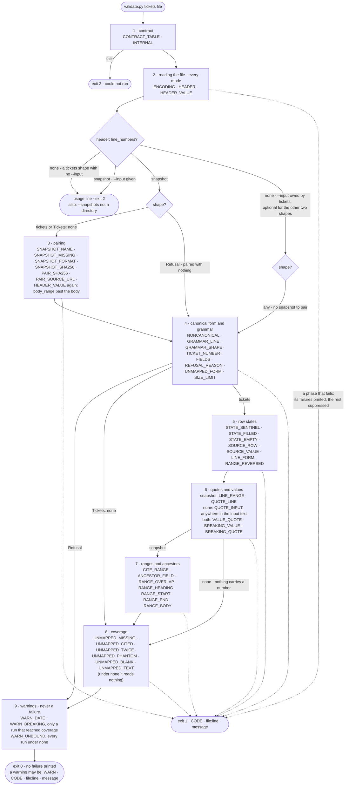
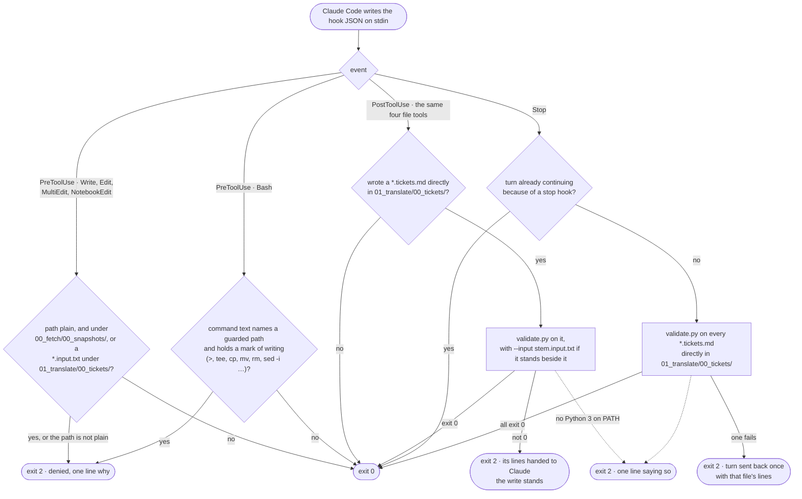
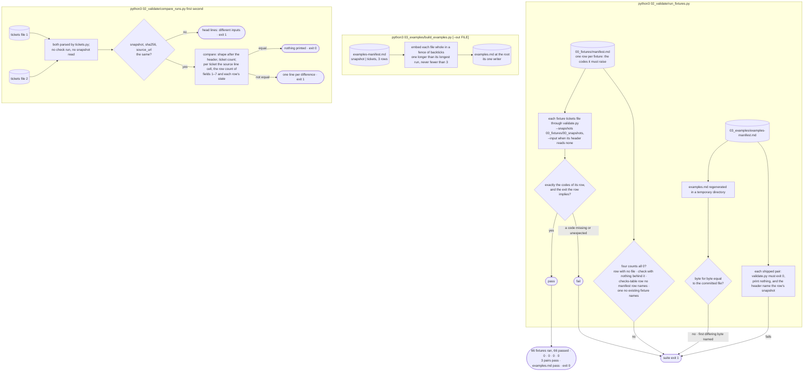
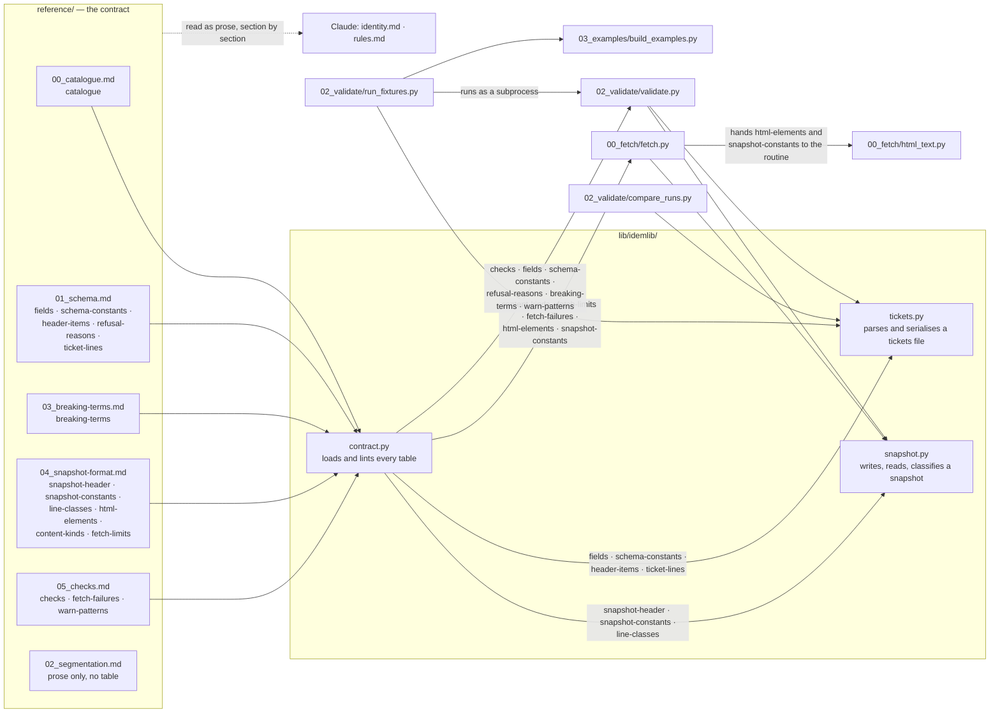

# Idem

Idem turns an API vendor's changelog into migration tickets of one fixed shape. Every filled value
carries a verbatim quote from the changelog and, where the input carries line numbers, the number
of the line that quote stands on; every value the changelog does not state is marked
`not in source`; and every line no ticket draws on is listed under `Unmapped`, so that the input can
be read back out of the output.
It does not rate, rank, advise, infer or compute. `identity.md` says what it takes, what it returns
and what it refuses.

The translation is done by Claude, in Claude Code or in a claude.ai Project, reading `identity.md`,
`rules.md` and the files of `reference/`. Fetching a page and checking the answer are done by
Python scripts that use no model. This file is for the person using or judging the folder: how to
run it, what a passing check does and does not prove, and what is not built. An agent is routed by
`CLAUDE.md`. The whole run, every script and every decision, is drawn in the
[Operation map](#operation-map).

## What is here

| Entry | What it is |
| --- | --- |
| `identity.md` | what Idem converts, from what, to what, and what it refuses |
| `rules.md` | the procedure the translator follows, step by step, and what it has not settled |
| `examples.md` | three worked pairs — a shipped snapshot and the tickets file written for it, input then output, each a byte copy in a fenced block; generated by the script in `03_examples/` from its manifest, committed, and never edited by hand |
| `reference/` | the contract, in six files: the catalogue that names every table, the schema of a tickets file, what one change is, the list that decides `breaking`, the snapshot format and every check the validator runs, in tables the tools load |
| `00_fetch/` | step 00: `fetch.py`, one URL or a file of them to numbered, hashed snapshots; three shipped snapshots in `00_snapshots/` |
| `01_translate/` | step 01: the translation, done by Claude; its answers go in `00_tickets/`, which holds the tickets files of the three shipped snapshots |
| `02_validate/` | step 02: `validate.py`, one tickets file to pass or coded failures; `compare_runs.py`, whether two tickets files of one input have one shape; `run_fixtures.py`, the suite; the fixture corpus in `00_fixtures/` |
| `03_examples/` | step 03: `build_examples.py`, which assembles `examples.md` from `examples-manifest.md`, and its test |
| `lib/` | shared code: the contract loader, one reader and writer per file format, and the tests |
| `.claude/` | Claude Code hooks: `settings.json` and one `sh` wrapper, `hooks/idem-hook.sh`, that denies writes to the snapshots and runs the validator on tickets files, with its negative test |
| `CLAUDE.md` | the route for an agent working in this folder |
| `CONTEXT.md` | the pipeline on one screen |
| `README.md` | this file |
| `.gitignore` | keeps `.DS_Store` and Python bytecode out of the repository |

## Operation map

Seven diagrams, from the whole to the parts. The first is the map of everything a run touches; the
next five follow one tool each, every decision it makes and every way it ends; the last shows which
code reads which contract table. `stem` is a snapshot's file name without `.txt`. Scripts are code
and call no model; the translation is Claude's.

### 1. The whole run, from what the user brings to a checked tickets file

### 2. Fetch: one URL to one snapshot, or one coded failure

The tool is [fetch.py](00_fetch/fetch.py), and an HTML page goes through
[html_text.py](00_fetch/html_text.py). Every limit is a row of `fetch-limits` and every kind a row
of `content-kinds`, both in [04_snapshot-format.md](reference/04_snapshot-format.md#what-fetch-stores-and-what-it-refuses);
every code is a row of `fetch-failures` in
[05_checks.md](reference/05_checks.md#where-a-fetch-failure-is-coded). A failed URL writes nothing
and never stops the others.

### 3. Translate: the six steps of `rules.md`

The steps are those of [rules.md](rules.md), read after [identity.md](identity.md). Claude reads
only what the conversation supplied. Each step names the section of the file in
[reference/](reference/) that owns what it does; the step says when, the reference file says what.

### 4. Validate: nine phases, the first one that fails is the one printed

`python3 02_validate/validate.py [--snapshots DIR] [--input FILE] <tickets>`. The tool is
[validate.py](02_validate/validate.py); the phases, and what each mode skips, are in
[05_checks.md](reference/05_checks.md#the-phases). The header alone decides the mode; no flag
chooses one. Every failure of the first failing phase is printed in file order, and the phases
after it do not run.

### 5. The Claude Code hooks

One POSIX `sh` wrapper, [idem-hook.sh](.claude/hooks/idem-hook.sh), registered on three events in
[.claude/settings.json](.claude/settings.json). It exits 0 or 2 and holds no check of its own;
[.claude/CONTEXT.md](.claude/CONTEXT.md) states its limits.

### 6. The suite, the examples and the run comparer

The suite is [run_fixtures.py](02_validate/run_fixtures.py), driven by
[manifest.md](02_validate/00_fixtures/manifest.md); the examples are written by
[build_examples.py](03_examples/build_examples.py) from
[examples-manifest.md](03_examples/examples-manifest.md) into [examples.md](examples.md); the run
comparer is [compare_runs.py](02_validate/compare_runs.py).

### 7. Code and contract: who reads which table

Everything that can be listed is written once, as a table in [reference/](reference/), and loaded
by [contract.py](lib/idemlib/contract.py); no script holds a value of it.
[00_catalogue.md](reference/00_catalogue.md#the-catalogue) names all 16 tables. The readers of the
two file formats are [snapshot.py](lib/idemlib/snapshot.py) and
[tickets.py](lib/idemlib/tickets.py).

## Running it

Steps 1 to 3 are one run, carried out in order: fetch a changelog, translate the snapshot, validate
the answer; step 4 checks the tools themselves. Python 3.9 or later, standard library only; there
is nothing to install. Run every command from the root of the clone. Everything below was run on
macOS with the system `/usr/bin/python3`, which is
3.9.6; the tests and the suite were also run on 3.14.4.

    git clone https://github.com/sergeymanevitch/Idem.git
    cd Idem

On Windows, write `py -3` wherever this file writes `python3`; nobody has run Idem on Windows. The
Claude Code hooks need a POSIX `sh`; without one on PATH they do not run, the snapshots are not
guarded, and the validator is run by hand.

### 1. Fetch a changelog

    python3 00_fetch/fetch.py [--out DIR] (<url> | --urls FILE)

One `http` or `https` URL gives one snapshot: the text the page served, a header saying where and
when it came from with the `sha256` of its body, and a number on every body line. The file lands in
`00_fetch/00_snapshots/`, or in `DIR`, a directory that already exists, when `--out` names one. Its
name is made from the URL's host and path and the UTC time of the fetch, and its path is printed;
the exit is 0. For example, the PagerDuty snapshot shipped here was fetched from:

    python3 00_fetch/fetch.py https://raw.githubusercontent.com/PagerDuty/api-schema/f2c09c0df6b3c4bd9d5df8a9940014785a8fb87f/docs/CHANGELOG.md

Run as written, this adds a second PagerDuty file beside the shipped one, named with the time of
your fetch: that file is the snapshot to translate in step 2. To try fetch without adding a file to
the clone, name a directory with `--out`; a snapshot fetched into `DIR` is validated with
`--snapshots DIR`.

`--urls FILE` fetches every URL of a UTF-8 file, one a line, in order, and prints one line for
each in that order. Spaces and tabs around a line are stripped; empty lines and lines starting
with `#` are skipped; a URL repeated on a later line is fetched once, and the repeat prints
`WARN<TAB>url<TAB>line N repeats line M; not fetched again`, which is not a failure. A repeat is
the line as written, so two spellings of one URL — `Example.com` and `example.com`, or one with a
fragment and one without — are two fetches, and the second inside one second is
`SNAPSHOT_EXISTS`. A failed URL never stops the rest. The exit is the highest seen: 0 when every
URL gave a snapshot, 1 when any failed, 2 when the tool could not run — a URL file that cannot be
read, is not UTF-8 or holds no URL is usage — or when one URL met an internal error: its line is
`INTERNAL`, the rest are still fetched and their snapshots are on disk.

A snapshot is created exclusively and never overwritten: a second fetch of one URL is a new file
beside the first, and two fetches of one URL inside the same second are a failure. Never edit a
snapshot; it is the evidence every ticket cites.

A URL that fails writes nothing and prints one line, `CODE<TAB>url<TAB>message`, and the exit is
1; the codes are a table of `reference/05_checks.md`. Exit 2 is a tool that could not run, such as bad
usage. On macOS a `python3` installed from python.org ships without root certificates, and every
fetch under it fails with `CERTIFICATE`. Run fetch with `/usr/bin/python3`, which reads the system
trust store, or install the certificates as the failure message says. Fetch never turns
verification off.

Fetch classifies every response by the `content-kinds` table of `reference/04_snapshot-format.md`:
a signature at the first byte decides whatever the Content-Type says, then the media type, then a
parse that finds JSON, then a NUL byte, and what is left is text. Markdown, plain text, RSS, Atom
are stored exactly as they were served, and so is any other media type whose bytes decode and hold
no NUL, as `text`; an HTML page, by its media type alone, is reduced to text by one routine,
`html-text`, which removes the markup and the scripts, writes a heading as `#` × its level and a
list item as `- ` indented two spaces a level, lays the text out in lines and collapses its white
space (`reference/04_snapshot-format.md`, **What the HTML routine does**); JSON, a PDF, an archive
and a binary, a NUL under any media type among them, fail with `UNSUPPORTED_TYPE`. Point it at a raw Markdown or
plain-text file, as the three shipped snapshots are:

| Vendor | File | Body lines | What it is for |
| --- | --- | --- | --- |
| PagerDuty | `api-schema/docs/CHANGELOG.md`, at a pinned commit | 166 | tidy |
| Docker Engine API | `docs/api/version-history.md`, at a pinned commit | 250 | messy: items wrapped onto unindented lines, and 56 lines in `Unmapped` |
| Plaid | `plaid-openapi/CHANGELOG.md`, at a pinned commit | 200 | near-empty: mostly `not in source` |

`00_fetch/00_snapshots/CONTEXT.md` names each file and the commit or tag it was read at; the URL
each was fetched from is the first line of its header.

### 2. Translate it

In Claude Code, open this folder and name the snapshot to translate; `CLAUDE.md` routes the agent,
and the answer belongs in `01_translate/00_tickets/<stem>.tickets.md`, where `<stem>` is the
snapshot's file name without `.txt`. For the shipped PagerDuty snapshot,
`raw-githubusercontent-com-pagerduty-api-schema-f2c09c0df6b3c4bd9d5df8a9940014785-20260922T032148Z.txt`,
the answer is
`01_translate/00_tickets/raw-githubusercontent-com-pagerduty-api-schema-f2c09c0df6b3c4bd9d5df8a9940014785-20260922T032148Z.tickets.md`.
The three shipped snapshots were translated this way, each in a headless session (`claude -p`)
started with the snapshot's file name and nothing else, run from the author's working copy, so the
author's own instruction files were loaded beside this one; their tickets files stand in
`01_translate/00_tickets/`, never edited after the model wrote them. `rules.md` says what it has not
settled.

A Claude Code session that is already running somewhere else — the one that cloned this repository,
say — translates the same way, without a new session: it reads `CLAUDE.md`, section **To translate
a snapshot**, and follows it for the snapshot of step 1. The hooks below are loaded only by a
session started in this folder, so such a session validates its answer by hand, with step 3.

In Claude Code, `.claude/settings.json` registers hooks on three events, all through one POSIX
`sh` wrapper, `.claude/hooks/idem-hook.sh`:

- **Before** a `Write`, `Edit`, `MultiEdit` or `NotebookEdit`, a path under
  `00_fetch/00_snapshots/` is denied with one line saying why, and so is any `*.input.txt` under
  `01_translate/00_tickets/`. **Before** a `Bash` command, one whose text names either of those
  and holds a mark of writing (a `>`, or `tee`, `cp`, `mv`, `rm`, `sed -i` and the like) is
  denied the same way; the limits below say what that guess misses.
- **After** one of those tools writes a `*.tickets.md` directly in `01_translate/00_tickets/`, the
  validator of step 3 runs on it, and its failure lines are handed back to Claude. The write is
  not undone.
- **When the turn would end**, the validator runs over every `*.tickets.md` directly in that
  folder, never its `CONTEXT.md`, and while one fails the turn is sent back with that file's lines.
  It is sent back once: when Claude Code reports that the turn is already continuing because of a
  stop hook, the wrapper lets it end. Claude Code ends the turn after 8 consecutive stop-hook
  blocks, per its hooks reference (https://code.claude.com/docs/en/hooks, read 2026-09-24); beyond
  that the failing file is still there and `validate.py` still fails on it. This wrapper never
  reaches that cap: it stands down on the second stop, so it never blocks twice in a row.

The wrapper exits 0 or 2, never the validator's own code; no Python 3 on PATH is exit 2 with one
line saying so, and the deny needs no Python. On exit 0 whatever the validator printed, its
warnings included, goes to Claude Code's debug log and Claude never sees it; every run on a file
written from pasted text prints one such warning. A tickets file written from pasted text, whose
header reads `line_numbers: none`, is validated against that text only if you save it by hand as
`<stem>.input.txt` beside `<stem>.tickets.md`; the hook hands it to the validator as `--input`,
and without it the validator prints its usage line. Every hook is held by the negative test,
`.claude/hooks/test_idem_hook.py`. Three were also seen live in one Claude Code session on
2026-09-24: the deny on `Edit` against a snapshot, the validator's lines handed back after a
`Write` of a tickets file, and the turn sent back once and then let go; the `Bash` deny fired in a
second session the same evening, on `echo … >>` against a snapshot. The deny on `Write`,
`MultiEdit` and `NotebookEdit` and the `*.input.txt` deny have not fired in a session.

In claude.ai, follow [In a claude.ai Project](#in-a-claudeai-project) below and save the answer
under the same name.

### 3. Validate the answer

    python3 02_validate/validate.py [--snapshots DIR] [--input FILE] <tickets>

For an answer saved as above:

    python3 02_validate/validate.py 01_translate/00_tickets/<stem>.tickets.md

and, filled in for the PagerDuty snapshot:

    python3 02_validate/validate.py 01_translate/00_tickets/raw-githubusercontent-com-pagerduty-api-schema-f2c09c0df6b3c4bd9d5df8a9940014785-20260922T032148Z.tickets.md

The validator reads the snapshot the file's header names from `00_fetch/00_snapshots/`, or from
`DIR` when `--snapshots` names another folder, except for a refusal, which is paired with nothing.
The header alone decides the mode. A file whose header reads `line_numbers: none` was written from
pasted text with no line numbers, and it needs `--input` naming that text: what was pasted, saved
by you to a file. Saved as `01_translate/00_tickets/<stem>.input.txt`, beside the tickets file,
it is the text the Claude Code hooks hand over. A file whose header reads `line_numbers: snapshot`
refuses the flag. Owed and missing, or given and refused, prints the usage line and exits 2;
`--snapshots`, if given, must still name a directory that exists, in either mode. Every run in the
mode with no line numbers prints one warning saying the binding of quotes to lines was not checked.

Exit 0 means no failure was printed; warnings may have been. Exit 1 means at least one failure was
printed; exit 2 means the tool could not run. A failure (exit 1) is one line,
`CODE<TAB>file:line<TAB>message`, where `file:line` is always a line of the tickets file, even when
the subject is the snapshot; a warning is `WARN<TAB>CODE<TAB>file:line<TAB>message`. The checks run
in fixed phases, and only the failures of the first phase that fails are printed, so fix what is
printed and run again until the exit is 0. Two files of the committed corpus show both ends:

    python3 02_validate/validate.py --snapshots 02_validate/00_fixtures/00_snapshots 02_validate/00_fixtures/01_tickets/clean-01.tickets.md
    python3 02_validate/validate.py --snapshots 02_validate/00_fixtures/00_snapshots 02_validate/00_fixtures/01_tickets/quote_line-01.tickets.md

The first prints nothing and exits 0. The second prints one failure line, a quote that is not on the
body line it cites, and exits 1.

**What exit 0 clears.** It clears a tickets file of everything the checks table of
`reference/05_checks.md` names. In either mode the file is well formed and every copied value is a
span of its own quote. Under `line_numbers: snapshot`, except for a refusal, which is paired with
nothing, it also belongs to the snapshot it names, that snapshot's body still matches its own
digest, every quote stands on the line it cites, the ticket ranges hold together, and `Unmapped`
lists exactly the non-blank lines of the translated range that no ticket cites. It does not clear
what no check can name: a date filed under the wrong field inside its own ticket's range, a quote
taken from another line holding the same text inside that range or on a line its field may cite
above it, or a `not in source` where the source does state the value. Read `Unmapped`, the warning
lines and every `not in source` row by eye before the tickets are used. `02_validate/CONTEXT.md`,
section **Human check**, gives the whole list, mode by mode.

### 4. The suite and the tests

    python3 02_validate/run_fixtures.py

The suite runs the validator over 66 fixture tickets files, each against the exact set of codes
its row of `02_validate/00_fixtures/manifest.md` says it must raise, and fails on a missing code and
on an unexpected one alike. It prints one line per fixture, then `66 fixtures ran, 66 passed` and
four counts, each 0, and exits 0: a manifest row whose file is missing, a check registered with
nothing behind it, a row of the checks table no manifest row names, and one no existing fixture
names. Any count above zero fails the suite. The checks table has 48 rows: 46 checks written; the
table's other two rows are the two codes the tool raises when it cannot run.

The same command holds the examples. After the 66 fixture lines it prints one line per row of
`03_examples/examples-manifest.md` — the three shipped pairs — and one for `examples.md`, all
`pass`: each pair's tickets file is run through the validator with the shipped snapshot folder and
must exit 0 and print nothing, a warning included; its header must name the row's snapshot; and
`examples.md` is regenerated into a temporary directory, which is deleted afterwards, and must
equal the committed file byte for byte. A `fail` on any of the four lines fails the suite like a
fixture's; the `examples.md` line then names the first differing byte and its line. Nothing is
written into the repository. A tickets file in `01_translate/00_tickets/` that no manifest row
names is not a failure: that folder is the product, new every run.

    python3 03_examples/build_examples.py [--out FILE]

The examples script writes `examples.md` at the root, whole, from the manifest — or, with `--out`,
the file named — and prints nothing on success. It is the file's one writer: a change to the
script, the manifest or a shipped pair means running it again and committing what it writes, and
the suite says so when that has not been done. Each embedded file sits in a fence of backticks one
longer than the longest run inside it and never fewer than three, so nothing inside can close it,
and `extract(embed(b)) == b` holds for any bytes.

    python3 02_validate/compare_runs.py <first> <second>

The run comparer says whether two tickets files of one input have the same shape: the same shape
after the header (tickets, no change, or a refusal with the same reason), the same number of
tickets, and for each ticket in order the same `source` line cell, the same number of rows of each
of fields 1 to 7 and the same state on each of those rows, filled, `not in source` or neither. It
compares no value, no quote, no line cell of fields 1 to 7 and not `Unmapped`, and it does not
validate either file. It prints nothing and exits 0 when the shapes are equal; otherwise it prints
one line per difference, `ticket N<TAB>field<TAB>message`, `head<TAB>item<TAB>message` or
`file<TAB>path<TAB>message`, and exits 1; exit 2 means it could not run. If the `snapshot`,
`sha256` or `source_url` items of the two headers differ, it says the headers name different inputs
and compares nothing more. Under `line_numbers: none` those three items read `not in source`, so the
input is not identified and any two such files count as one input, and every `source` line cell
reads `not in source` too, so no range is compared. Two files of the committed corpus:

    python3 02_validate/compare_runs.py 02_validate/00_fixtures/01_tickets/clean-01.tickets.md 02_validate/00_fixtures/01_tickets/clean-03.tickets.md

prints one line, `file`, the second path and `tickets in the first file, no change in the second`,
and exits 1; the first file given twice prints nothing and exits 0.

The tests are five commands, and "the tests" means all five:

    python3 -m unittest discover -s lib/tests -t lib
    python3 -m unittest discover -s 02_validate -t 02_validate
    python3 -m unittest discover -s 00_fetch -t 00_fetch
    python3 -m unittest discover -s .claude/hooks -t .claude/hooks
    python3 -m unittest discover -s 03_examples -t 03_examples

Run on 2026-09-25 from a fresh clone, on 3.9.6 and on 3.14.4: 726 tests OK, 472 OK, 296 OK, 46 OK
and 38 OK. The second command takes about three minutes. Two of the first command's tests need 3.11
or later and are skipped below it. Nobody has run 3.10 to 3.13. Two others find the shipped
PagerDuty snapshot by the vendor's name and fail while a second PagerDuty snapshot stands beside it,
as step 1 run as written leaves one: run the tests in a clone with nothing fetched into
`00_fetch/00_snapshots/`, or move your snapshot out first. The third needs no network: it runs
`fetch.py` against a stub server on 127.0.0.1. The fourth is the negative test of the hook wrapper:
it feeds the wrapper hook input in a temporary folder, under `/bin/sh` and under `dash` when it is
on PATH. The fifth holds the examples script, every output in a temporary directory.
`python3 lib/idemlib/contract.py` loads the contract on its own and prints
`16 tables, 221 rows, named by reference/00_catalogue.md` last, with exit 0.

## In a claude.ai Project

Nothing runs in a Project: no fetch and no validator. The translation runs on the uploaded files
alone, and the answer is validated afterwards, in a clone.

1. **Upload these eight files**, flat, as they are named; they cite one another by bare name:
   `identity.md`, `rules.md`, `00_catalogue.md`, `01_schema.md`, `02_segmentation.md`,
   `03_breaking-terms.md`, `04_snapshot-format.md`, `05_checks.md`. The last six are the files of
   `reference/`. Together they are 235,711 bytes, measured on 2026-09-25; it changes when those
   files change. `examples.md` is **not** uploaded, although `rules.md` names it: generated, it is
   366,814 bytes, which with the other eight would put the set at or past a 200,000-token window,
   where a Project stops reading files whole and switches to retrieval, and it carries the whole
   answer for the PagerDuty snapshot — the input of the recorded run — which an answer must not copy
   from. The sentence in `rules.md` says only that the file is never a source of a value, which
   stays true. A reader who wants the form of a finished tickets file opens `examples.md` in the
   clone; the translator has the four examples of `01_schema.md`.
2. **Leave out everything else**: `examples.md`, `00_fetch/`, `01_translate/`, `02_validate/`,
   `03_examples/`, `lib/`, `.claude/`, `CLAUDE.md`, `README.md`, `.gitignore`, and every
   `CONTEXT.md`, the one at the root, the one in `reference/` and each step's.
3. **Project instructions**, this one line and nothing else:

       Read identity.md, then rules.md, and do what they say

4. **Paste a snapshot, not the raw changelog.** Paste the whole snapshot file as text, header and
   numbered body. With line numbers every quote is held to its line; from pasted raw text the answer
   is in the mode with no line numbers, where a quote is only searched for anywhere in the text and
   `Unmapped` is held to nothing. Prefer a snapshot of a Markdown source: headings and lists are
   what the range checks read.
5. **Type the snapshot's bare file name on the line above the pasted text**, so that the answer can
   name its snapshot; the answer's header should then carry `snapshot: <the snapshot's file name>`.
   Every answer of the Project runs below carried it. The earlier run of 2026-09-21, which did not
   do this, gave its snapshot as `not in source` in both answers, and the validator stops both at
   line 1 with `HEADER_VALUE`.
6. **Keep to the size limit**: the contract is written for inputs of up to 250 body lines, the
   largest body a recorded run has held; `01_schema.md` says what happens over it.
7. **Save the answer** in a clone as `01_translate/00_tickets/<stem>.tickets.md`, ending in one line
   feed, and validate it with the command of step 3 above. An answer copied with the Copy button may
   end without a line feed, which the validator reads as a departure from canonical form,
   `NONCANONICAL`, and may bring the chat's opening sentence glued to the header's first line, which
   stops it at line 1; the answer is the text from `snapshot: ` on.

**The recorded Project runs**, on 2026-09-24 (New York time), were made in a claude.ai Project in
the Claude desktop app, with no connectors, on Opus 5.5 at medium effort; that is what was used, not
a recommendation. Each shipped snapshot was pasted as steps 4 and 5 say, in three chats of its own.
Every answer was complete and passed the validator once what the Copy button brings was removed, and
for PagerDuty (64 tickets) and Plaid (102) the three answers gave one shape by
`02_validate/compare_runs.py`. Docker's first three did not: one answer read two wrapped items and
one version-bound sentence differently from the other two, the contract gained the two sentences
that decide them, and three new chats on the new files gave one shape, 155 tickets. An earlier run,
on 2026-09-21, gave the PagerDuty body twice with earlier files and no snapshot name typed; both
answers stop at line 1 with `HEADER_VALUE`. The records of these runs, their inputs and every answer
are not in this repository.

## What is not built

- A live run of every deny: `PreToolUse` on `Edit` and on `Bash`, `PostToolUse` and `Stop` have
  fired in Claude Code sessions (see step 2); the file-tool deny on `Write`, `MultiEdit` and
  `NotebookEdit` and the `*.input.txt` deny are proved by the negative test alone.

## Limits

- **`sha256` detects an accidental edit, not a deliberate one.** It proves a snapshot's body has not
  changed since it was fetched, not that it matches the vendor's page. Whoever edits a body can
  write its new digest into the header, nothing downstream can tell that file from a page served
  that way, and git history is the only tamper record (`00_fetch/00_snapshots/CONTEXT.md`).
- **A snapshot's name leaves the query out**, so in one URL file, `?page=1`, `?page=2`, … of one
  path collide when fetched inside one second, and every one after the first is `SNAPSHOT_EXISTS`:
  the name is host and path by the snapshot format, and a digest of the query in it is not built.
  The workaround is one file per page, run separately, or no more than one such URL per second
  (`00_fetch/CONTEXT.md`, **Outputs**).
- **An HTML page is only as good as its markup.** A page whose text is drawn by JavaScript reduces
  to what it holds without its scripts: nothing, which is `EMPTY_BODY`, or, for a shell with a
  `title` and a `noscript`, those two lines and no changelog. A charset stated only in a `<meta>`
  element is not read. `pre` is collapsed to one line, a custom element is inline, and served text
  that begins `- ` or `#` reads as an item or a heading. The routine's output is pinned on 3.9.6 and
  3.14.4 for well-formed markup; some malformed markup gives two texts on the two
  (`reference/04_snapshot-format.md`, **What the HTML routine does**).
- **A false `not in source` cannot be caught mechanically**: nothing mechanical can tell what a
  source does not say. The backstop is `Unmapped`, which must list every non-blank line no ticket
  cites, and the warning lines that point at a listed line inside a ticket's range holding a date
  or a phrase of the list that decides `breaking` (`02_validate/CONTEXT.md`, section
  **Human check**).
- **In a changelog with no headings and no lists the range checks constrain little**: where one
  change ends and the next begins is then held by nothing but the translator's rule
  (`reference/05_checks.md`, the paragraph on what the ranges phase cannot hold).
- **In the mode with no line numbers nothing binds the input text to the tickets file.** The header
  of such a file names no snapshot and carries no digest, a quote passes if it is found
  anywhere in the text given with `--input`, and `Unmapped` is held to nothing
  (`reference/05_checks.md`, **What each mode skips** and the coverage paragraph before it).
- **A refusal's header is verified by nothing.** A refusal under `line_numbers: snapshot` names the
  snapshot it refused, and no check reads that name, its digest or its URL, because a refusal is
  paired with nothing (`reference/05_checks.md`, **What each mode skips**).
- **The hooks guard the file tools, and guess at the shell.** A `Bash` command in Claude Code
  whose text names `00_fetch/00_snapshots/` or a `*.input.txt` and holds a mark of writing (a `>`,
  or `tee`, `cp`, `mv`, `rm`, `sed -i` and the like) is denied; one that hides the name in a
  variable, a `cd` or an interpreter is not seen, and a reading command that also holds `>` is
  denied wrongly, at the cost of one Read tool call (`.claude/CONTEXT.md`, Limits). The guard that
  holds whatever wrote a snapshot is its recorded `sha256`. A path is compared with the root as text: one that is not absolute, or holds `//`, `/./`,
  `/../` or a backslash, is denied as not plain, and any part of the path spelled differently from
  what the wrapper compares — the root through a symlink, or any part in another case, such as
  `00_Snapshots`, `x.INPUT.TXT` or `x.TICKETS.md` — is not recognised, so the deny does not fire
  and the file is not validated; on a case-insensitive volume, the default on macOS, such a path
  still reaches the real file (`.claude/CONTEXT.md`, **Limits**).
- **Nothing forbids writing a tickets file with a script.** The translation is Claude's, not a
  script's (`01_translate/CONTEXT.md`), but no rule of `rules.md` says so to the translator. Each
  Claude Code session that wrote the shipped tickets files first tried to generate its file with a
  script of its own, and what stopped it was the headless session's permissions and the hook's
  guess at the shell, not a rule; in an interactive session, decline the prompt to run such a
  script. A fresh session of 2026-09-25 that followed this README with an open shell and no hook
  wrote its tickets file with the `Write` tool and tried no script.
- **Nothing runs in a claude.ai Project.** There, `rules.md` and the reference files carry the
  contract alone, and nothing is checked until the answer is validated in a clone.

## How it is built

Four step folders, filters that never call each other: each reads files the one before it wrote and
writes its own. All four are built.

    URL ──fetch (code)──▶ 00_snapshots/*.txt ──translate (Claude)──▶ 00_tickets/*.tickets.md
        00_tickets/*.tickets.md + its snapshot ──validate (code)──▶ pass / fail
        00_snapshots/*.txt + validated 00_tickets/*.tickets.md ──examples (code)──▶ examples.md

**One owner for the contract.** Everything that can be listed — the fields of a ticket and their
order, the phrases that decide `breaking`, the refusal reasons, the limits, the check codes — is
written once, as tables in `reference/`, and the tools load those tables when they start. A tool
holds no value of the contract, no phrase and no limit: it holds the names it asks the tables by,
and a few sanctioned exceptions, recorded where they are granted, in the reference files and in
`lib/CONTEXT.md`. The file you open to read the contract is the file the tools enforce.

**The check holds the claim.** Under `line_numbers: snapshot` a quote must stand verbatim on the
line it cites; in the mode with no line numbers it must be found somewhere in the input text. A
value copied from the source must be a span of its own quote; `breaking` is filled from a closed
list instead, and its value must be the one that list reads out of its quote. A field may cite
only lines inside its own change or, for the fields the schema allows, a heading or parent item
above it. Ticket ranges are disjoint or identical and hold no heading. Every non-blank line of the
translated range that no field cites must be listed under `Unmapped`. Citation scope, range shape
and coverage are read only where the lines are numbered. Each of these is a row with a key and a
code in `reference/05_checks.md`, and each has at least one committed fixture in
`02_validate/00_fixtures/` that must raise exactly the codes its manifest row names. The list of
what can be wrong, and the manifest of fixtures that must trip it, were written before the
validator.

**Evidence is never edited.** Only `fetch.py` writes into `00_fetch/00_snapshots/`, and a snapshot
never changes; the suite's fixture snapshots are built by hand on purpose, and
`02_validate/00_fixtures/CONTEXT.md` says which. A tickets file names its snapshot and copies that
snapshot's digest; the validator recomputes the digest of the body and compares. In Claude Code the
deny hook of `.claude/` refuses the file tools that folder.
